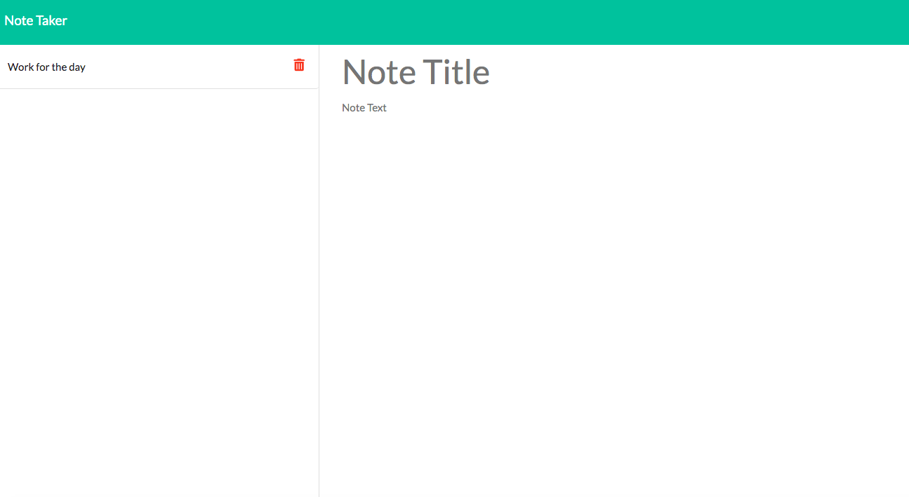

## License

# note-taker
This application will use an Express.js back end and will save and retrieve note data from a JSON file.

#  link 

## Below are the screen shorts for app. 

## Technologies used
* Node.js
* Express

### Contact Detail 
Email-Id : deeapaligarg.chd@gmail.com

